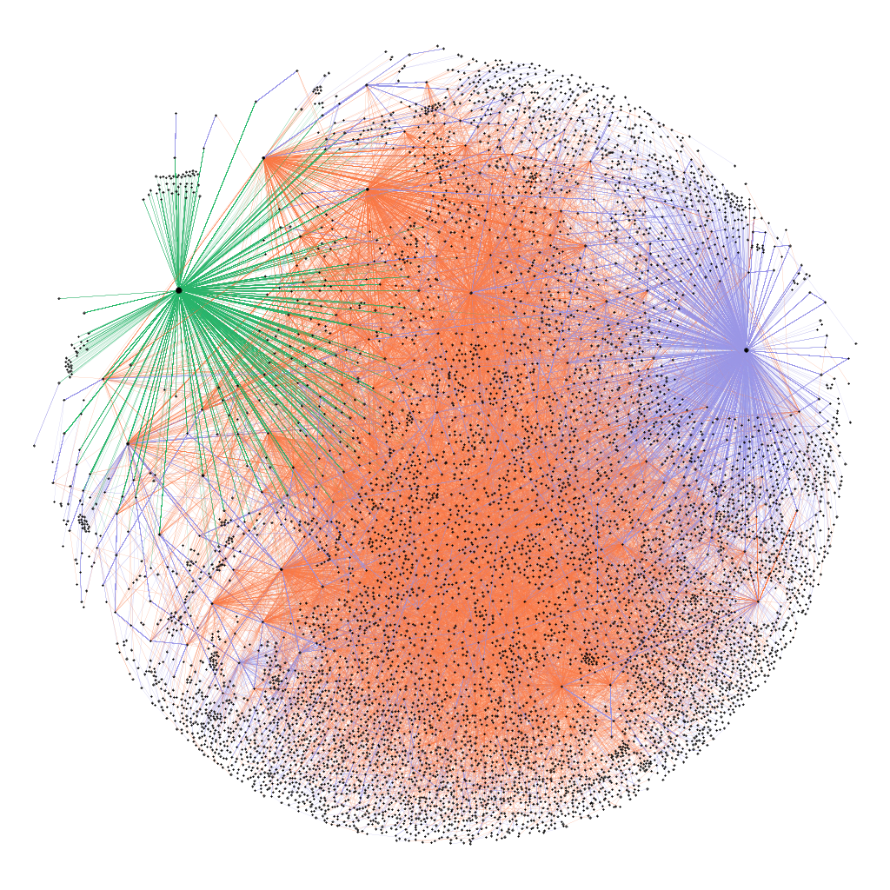

# sna_exam

Repo for my Social Network Analysis Exam. The work consists in an analysis of the CryptoPunks' network.

## Data:

punks_data folder contains several .csv files from [this](https://github.com/cryptopunksnotdead/punks.attributes/tree/master/original) repo.
logs_data folder contains all the logs about CryptoPunks' transactions starting from block [3914495](https://etherscan.io/tx/0x0885b9e5184f497595e1ae2652d63dbdb2785de2e498af837d672f5765f28430), that is the block in which cryptopunks contract was deployed.

